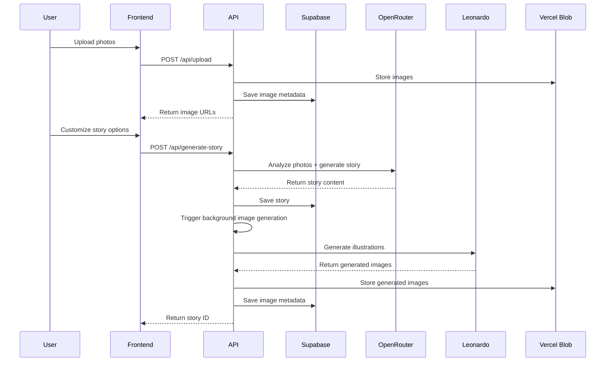
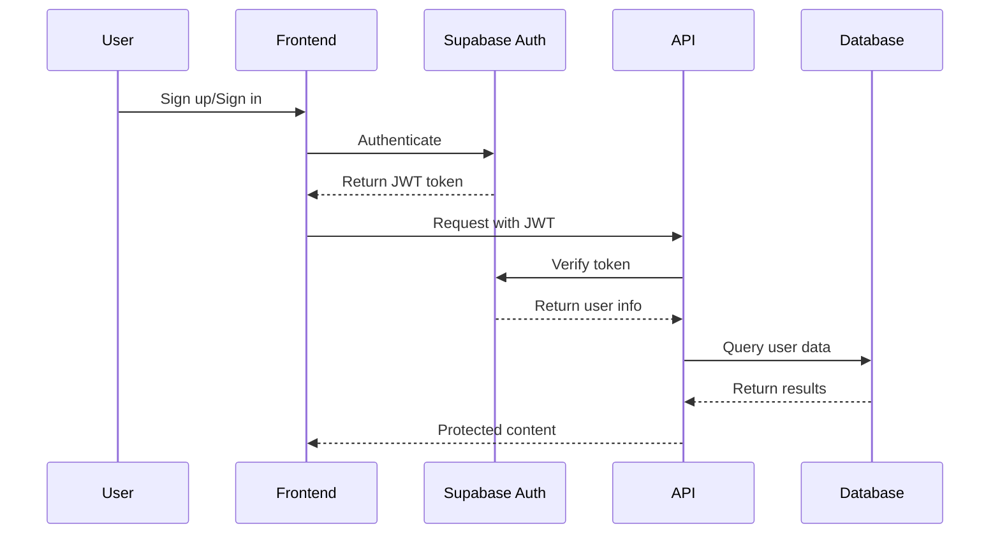

# System Architecture

This document provides a comprehensive overview of the StoryBook Creator system architecture, design decisions, and technical implementation details.

## Table of Contents

- [Overview](#overview)
- [System Architecture](#system-architecture)
- [Component Architecture](#component-architecture)
- [Data Flow](#data-flow)
- [API Design](#api-design)
- [Database Design](#database-design)
- [AI Integration](#ai-integration)
- [Security Architecture](#security-architecture)
- [Performance Considerations](#performance-considerations)
- [Deployment Architecture](#deployment-architecture)
- [Design Decisions](#design-decisions)

## Overview

StoryBook Creator is a full-stack Next.js application that transforms user-uploaded photos into AI-generated children's storybooks. The system leverages multiple AI services for content generation and provides a secure, scalable platform for story creation and sharing.

### High-Level Architecture

```
┌─────────────────┐    ┌─────────────────┐    ┌─────────────────┐
│   Frontend      │    │   Backend API   │    │   External      │
│   Next.js App   │◄──►│   App Router    │◄──►│   Services      │
│   React 19      │    │   Route Handlers│    │   - Supabase    │
│   TypeScript    │    │   Server Actions│    │   - OpenRouter  │
└─────────────────┘    └─────────────────┘    │   - Leonardo AI │
                                              │   - Vercel Blob │
                                              └─────────────────┘
```

## System Architecture

### Tech Stack

**Frontend Layer:**
- **Framework**: Next.js 15 with App Router
- **Runtime**: React 19 with Server Components
- **Language**: TypeScript for type safety
- **Styling**: Tailwind CSS 4 with CSS-in-JS patterns
- **UI Components**: Radix UI primitives with shadcn/ui design system
- **State Management**: React Server Components + Client Components hybrid

**Backend Layer:**
- **Runtime**: Next.js API Routes with App Router
- **Database**: Supabase (PostgreSQL) with Row Level Security
- **Authentication**: Supabase Auth with JWT tokens
- **File Storage**: Vercel Blob for scalable file handling
- **AI Services**: OpenRouter (story generation) + Leonardo AI (image generation)

**Infrastructure Layer:**
- **Deployment**: Google Cloud Run (containerized)
- **Container**: Docker multi-stage builds
- **CI/CD**: Google Cloud Build
- **Secrets**: Google Secret Manager
- **Monitoring**: Built-in Google Cloud monitoring

### Architecture Patterns

1. **Server-Side Rendering (SSR)**: Leverages Next.js Server Components for optimal performance
2. **API-First Design**: Clean separation between frontend and backend logic
3. **Event-Driven Architecture**: Asynchronous processing for AI-generated content
4. **Microservices Communication**: External AI services integrated via REST APIs
5. **Database-Per-Service**: Supabase handles all data persistence needs

## Component Architecture

### Frontend Components Structure

```
components/
├── ui/                          # Reusable UI primitives
│   ├── button.tsx              # Button component
│   ├── card.tsx                # Card layouts
│   ├── form.tsx                # Form controls
│   ├── dialog.tsx              # Modal dialogs
│   └── [other-ui-components]   # Additional UI elements
├── draggable-image-upload.tsx  # File upload component
├── generate-images-button.tsx  # AI image generation trigger
├── pdf-export-button.tsx       # PDF generation interface
├── recent-stories.tsx          # Story listing component
├── share-story-button.tsx      # Story sharing interface
├── story-card.tsx              # Story display card
├── story-customization.tsx     # Story options form
├── storybook-reader.tsx        # Story reading interface
└── theme-provider.tsx          # Theme management
```

### Component Design Principles

1. **Single Responsibility**: Each component has a focused purpose
2. **Composition over Inheritance**: Components are composed together
3. **Props Interface**: TypeScript interfaces for all props
4. **Accessibility First**: WCAG 2.1 AA compliant components
5. **Performance Optimized**: Efficient rendering with React 19

## Data Flow

### Story Creation Flow



### Authentication Flow



## API Design

### RESTful Endpoints

The API follows RESTful principles with clear resource-based URLs:

```
POST   /api/upload           # File upload
POST   /api/generate-story   # Story generation
POST   /api/generate-images  # Image generation  
GET    /api/download-pdf     # PDF export
DELETE /api/delete-story     # Story deletion
GET    /api/share/[id]       # Public story access
```

### Error Handling Strategy

```typescript
// Consistent error response format
interface APIError {
  error: string;
  code?: string;
  details?: Record<string, any>;
}

// HTTP status codes mapping
const ErrorCodes = {
  400: "Bad Request",
  401: "Unauthorized", 
  403: "Forbidden",
  404: "Not Found",
  500: "Internal Server Error",
  503: "Service Unavailable"
}
```

### Request/Response Patterns

**Authentication**: JWT tokens in cookies (handled by Supabase)
**Content Type**: JSON for all API communications
**Rate Limiting**: Implemented at the database level with RLS
**Validation**: Zod schemas for request validation
**Fallback Handling**: Graceful degradation when AI services unavailable

## Database Design

### Entity Relationship Diagram

```
┌─────────────┐      ┌─────────────┐      ┌─────────────┐
│   profiles  │      │   stories   │      │story_images │
├─────────────┤      ├─────────────┤      ├─────────────┤
│ id (PK)     │◄────┐│ id (PK)     │◄────┐│ id (PK)     │
│ display_name│     ││ user_id (FK)│     ││ story_id(FK)│
│ avatar_url  │     ││ title       │     ││ image_url   │
│ created_at  │     ││ content     │     ││ prompt      │
└─────────────┘     │└─────────────┘     ││ page_number │
                    │                    │└─────────────┘
                    │ ┌─────────────┐    │
                    └─┤uploaded_imgs│────┘
                      ├─────────────┤
                      │ id (PK)     │
                      │ user_id(FK) │
                      │ image_url   │
                      │ filename    │
                      └─────────────┘
```

### Database Schema Details

**profiles**
- Primary user information
- Links to Supabase auth.users
- Automatically created via trigger

**stories**
- Core story content and metadata
- Belongs to specific user
- Contains AI-generated narrative

**story_images**
- AI-generated illustrations
- Linked to specific story
- Includes generation prompts for reproducibility

**uploaded_images**
- User-uploaded source photos
- Temporary storage for story creation
- Can be cleaned up after story generation

### Row Level Security (RLS)

All tables implement RLS policies:

```sql
-- Users can only access their own data
CREATE POLICY "users_own_data" ON stories
  FOR ALL USING (auth.uid() = user_id);

-- Story images accessible through story ownership
CREATE POLICY "story_images_via_story" ON story_images
  FOR SELECT USING (
    EXISTS (
      SELECT 1 FROM stories 
      WHERE stories.id = story_images.story_id 
      AND stories.user_id = auth.uid()
    )
  );
```

## AI Integration

### OpenRouter Integration (Story Generation)

**Model**: Google Gemini 2.5 Flash Lite
**Purpose**: Analyze photos and generate child-appropriate stories
**Input**: Image URLs + customization preferences
**Output**: Structured story content with page breaks

```typescript
interface StoryCustomizations {
  ageGroup?: 'toddlers (2-4)' | 'preschool (4-6)' | 'early readers (6-8)' | 'young readers (8-12)' | 'all ages'
  theme?: 'friendship' | 'adventure' | 'family' | 'nature' | 'magic' | 'learning' | 'kindness' | 'courage'
  length?: 'short' | 'medium' | 'long'
  tone?: 'playful' | 'gentle' | 'exciting' | 'educational'
}
```

### Leonardo AI Integration (Image Generation)

**Model**: Flux Precision (Dev)
**Purpose**: Generate custom illustrations for story pages
**Input**: Story content + character/setting hints
**Output**: High-quality illustrations (1024x1024)

**Features**:
- Content moderation for child-appropriate images
- Style consistency across story pages
- Character and setting hints for continuity
- Automatic retry with safe prompts on content flags

### Fallback Strategies

1. **Story Generation**: Pre-written template stories when OpenRouter unavailable
2. **Image Generation**: Placeholder images when Leonardo AI fails
3. **Error Recovery**: Graceful degradation maintains core functionality

## Security Architecture

### Authentication & Authorization

**Authentication**: Supabase Auth with JWT tokens
**Authorization**: Row Level Security at database level
**Session Management**: Secure HTTP-only cookies
**Password Requirements**: Enforced by Supabase Auth

### Data Protection

**In Transit**: HTTPS encryption for all communications
**At Rest**: Supabase handles database encryption
**File Storage**: Vercel Blob with access controls
**API Keys**: Stored in Google Secret Manager

### Content Security

**Input Validation**: Zod schemas validate all inputs
**File Upload**: Type and size restrictions
**Content Moderation**: Automatic filtering in AI prompts
**XSS Prevention**: React's built-in protections
**CSRF Protection**: SameSite cookie attributes

### Privacy Considerations

**Data Minimization**: Only collect necessary user data
**User Consent**: Clear privacy policy and data usage
**Data Retention**: User can delete their own stories
**Geographic Restrictions**: None currently implemented

## Performance Considerations

### Frontend Performance

**Server Components**: Render content on server for better performance
**Code Splitting**: Automatic with Next.js App Router
**Image Optimization**: Next.js Image component with lazy loading
**Bundle Analysis**: Webpack bundle analyzer for optimization
**Caching**: Browser caching for static assets

### Backend Performance

**Database Queries**: Optimized with proper indexing
**Connection Pooling**: Supabase handles connection management
**API Caching**: Response caching where appropriate
**Async Processing**: Background image generation doesn't block responses
**Rate Limiting**: Database-level with RLS policies

### AI Service Optimization

**Request Batching**: Generate multiple images in parallel
**Timeout Handling**: Proper timeouts prevent hanging requests
**Retry Logic**: Exponential backoff for failed API calls
**Fallback Content**: Immediate response with placeholder content

## Deployment Architecture

### Container Architecture

```dockerfile
# Multi-stage Docker build
FROM node:20-alpine AS deps
FROM node:20-alpine AS builder  
FROM node:20-alpine AS runner
```

**Benefits**:
- Smaller final image size
- Improved security (non-root user)
- Optimal caching layers

### Google Cloud Run Configuration

**Scaling**: 0-10 instances with automatic scaling
**Resources**: 2GB memory, 1 CPU per instance
**Networking**: HTTPS termination at load balancer
**Environment**: Environment variables from Secret Manager

### CI/CD Pipeline

**Trigger**: Git commits to main branch
**Build**: Google Cloud Build with cloudbuild.yaml
**Security**: Secrets managed in Secret Manager
**Deployment**: Atomic deployments with rollback capability

## Design Decisions

### Technology Choices

**Next.js 15**: 
- Pros: Latest features, Server Components, excellent DX
- Cons: Cutting edge, potential stability issues
- Decision: Benefits outweigh risks for this project

**Supabase**:
- Pros: Full-featured backend, excellent DX, generous free tier
- Cons: Vendor lock-in, less control over infrastructure
- Decision: Rapid development needs justify trade-offs

**TypeScript**:
- Pros: Type safety, excellent tooling, catches errors early
- Cons: Additional build complexity
- Decision: Essential for maintainable code

### Architecture Patterns

**App Router vs Pages Router**:
- Chose App Router for future-proofing and Server Components
- Trade-off: Smaller ecosystem, fewer examples

**Server vs Client Components**:
- Maximize Server Components for performance
- Use Client Components only when necessary (interactivity)

**Monolith vs Microservices**:
- Chose monolithic Next.js app for simplicity
- External AI services provide natural service boundaries

### Data Storage Strategy

**Database**: PostgreSQL via Supabase
- Relational data fits well with story relationships
- ACID compliance important for user data

**File Storage**: Vercel Blob
- Integrates well with Next.js
- Simple API, automatic CDN distribution

**AI Service Integration**: Direct API calls
- Simple implementation
- Could be moved to queue system for high volume

### Future Considerations

**Scalability**: Current architecture supports moderate scale
**Monitoring**: Add comprehensive logging and metrics
**Caching**: Redis layer for frequently accessed data
**Background Processing**: Queue system for AI generation
**Internationalization**: Multi-language support structure
**Mobile App**: API-first design enables native app development

---

This architecture provides a solid foundation for the StoryBook Creator application while maintaining flexibility for future enhancements and scale requirements.