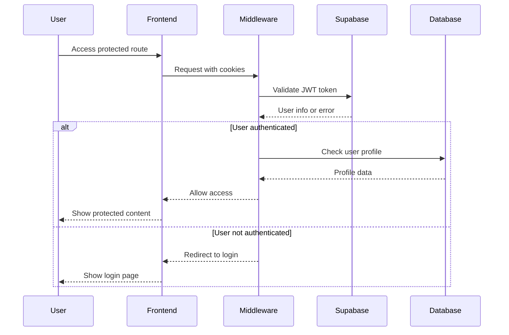

# Authentication Documentation

This document provides comprehensive information about the authentication system in StoryBook Creator, which uses Supabase Auth for user management and security.

## Table of Contents

- [Overview](#overview)
- [Authentication Architecture](#authentication-architecture)
- [User Registration Flow](#user-registration-flow)
- [Login Flow](#login-flow)
- [Session Management](#session-management)
- [Route Protection](#route-protection)
- [Database Integration](#database-integration)
- [OAuth Integration](#oauth-integration)
- [Security Features](#security-features)
- [Client-Side Implementation](#client-side-implementation)
- [Server-Side Implementation](#server-side-implementation)
- [API Authentication](#api-authentication)
- [Error Handling](#error-handling)
- [Best Practices](#best-practices)
- [Troubleshooting](#troubleshooting)

## Overview

StoryBook Creator implements a robust authentication system using Supabase Auth, providing:

- **Email/Password Authentication**: Traditional username/password login
- **OAuth Providers**: Google OAuth integration
- **JWT Token Management**: Secure session management
- **Row Level Security**: Database-level access control
- **Protected Routes**: Automatic redirection for unauthorized access
- **Profile Management**: Automatic user profile creation

### Key Features

- **Secure by Default**: HTTPS-only cookies, secure token storage
- **Scalable**: Built on Supabase's enterprise-grade infrastructure
- **User-Friendly**: Intuitive signup/login flows with error handling
- **Extensible**: Easy to add additional OAuth providers
- **Compliant**: GDPR-ready with proper data handling

## Authentication Architecture

### High-Level Flow



### Component Architecture

```
┌─────────────────┐    ┌─────────────────┐    ┌─────────────────┐
│   Client Side   │    │   Middleware    │    │   Server Side   │
├─────────────────┤    ├─────────────────┤    ├─────────────────┤
│ • Auth Forms    │◄──►│ • Session Check │◄──►│ • Protected APIs│
│ • Client Actions│    │ • Route Guard   │    │ • User Queries  │
│ • State Mgmt    │    │ • Cookie Mgmt   │    │ • Profile Mgmt  │
└─────────────────┘    └─────────────────┘    └─────────────────┘
         ▲                       ▲                       ▲
         │                       │                       │
         └───────────────────────┼───────────────────────┘
                                 ▼
                    ┌─────────────────────────┐
                    │    Supabase Auth       │
                    ├─────────────────────────┤
                    │ • JWT Management       │
                    │ • OAuth Providers      │
                    │ • User Storage         │
                    │ • Session Validation   │
                    └─────────────────────────┘
```

## User Registration Flow

### Email/Password Registration

1. **User Input**: User provides email and password
2. **Client Validation**: Password confirmation and format validation
3. **Supabase Registration**: Account creation via Supabase Auth
4. **Profile Creation**: Automatic profile generation via database trigger
5. **Email Confirmation**: Optional email verification (configurable)
6. **Redirect**: Redirect to dashboard or success page

```typescript
// Sign-up implementation
const { error } = await supabase.auth.signUp({
  email,
  password,
  options: {
    emailRedirectTo: `${window.location.origin}/dashboard`,
  },
});
```

### Registration Validation

**Client-Side Validation:**
- Email format validation
- Password strength requirements
- Password confirmation matching
- Required field validation

**Server-Side Validation:**
- Email uniqueness (handled by Supabase)
- Password complexity (configurable in Supabase)
- Rate limiting (built into Supabase Auth)

### Profile Auto-Creation

The system automatically creates user profiles using a database trigger:

```sql
CREATE OR REPLACE FUNCTION public.handle_new_user()
RETURNS TRIGGER
LANGUAGE plpgsql
SECURITY DEFINER
SET search_path = public
AS $$
BEGIN
  INSERT INTO public.profiles (id, display_name)
  VALUES (
    new.id,
    COALESCE(new.raw_user_meta_data ->> 'display_name', 'Anonymous User')
  )
  ON CONFLICT (id) DO NOTHING;
  
  RETURN new;
END;
$$;

CREATE TRIGGER on_auth_user_created
  AFTER INSERT ON auth.users
  FOR EACH ROW
  EXECUTE FUNCTION public.handle_new_user();
```

## Login Flow

### Email/Password Login

1. **Credentials Input**: User provides email and password
2. **Client Validation**: Basic format validation
3. **Supabase Authentication**: Credential verification
4. **Session Creation**: JWT token generation and cookie setting
5. **Profile Loading**: User profile data retrieval
6. **Dashboard Redirect**: Automatic redirect to main application

```typescript
// Login implementation
const { error } = await supabase.auth.signInWithPassword({
  email,
  password,
});

if (!error) {
  router.push('/dashboard');
}
```

### OAuth Login (Google)

1. **OAuth Initiation**: Redirect to Google OAuth consent screen
2. **User Consent**: User authorizes application access
3. **OAuth Callback**: Google redirects back with authorization code
4. **Token Exchange**: Supabase exchanges code for user data
5. **Account Linking**: Link OAuth account to Supabase user
6. **Session Creation**: JWT token generation
7. **Profile Creation**: Auto-create profile if new user

```typescript
// Google OAuth implementation
const { error } = await supabase.auth.signInWithOAuth({
  provider: 'google',
  options: {
    redirectTo: `${window.location.origin}/dashboard`,
    queryParams: { 
      prompt: 'select_account' 
    },
  },
});
```

## Session Management

### JWT Token Handling

StoryBook Creator uses Supabase's JWT-based authentication:

**Token Storage:**
- HTTP-only cookies (secure, not accessible via JavaScript)
- Automatic token refresh before expiration
- Cross-tab session synchronization

**Token Structure:**
```json
{
  "aud": "authenticated",
  "exp": 1704067200,
  "iat": 1704063600,
  "iss": "https://your-project.supabase.co/auth/v1",
  "sub": "user-uuid-here",
  "email": "user@example.com",
  "role": "authenticated"
}
```

### Session Lifecycle

1. **Creation**: JWT created on successful login
2. **Storage**: Stored in secure HTTP-only cookies
3. **Validation**: Verified on each protected route access
4. **Refresh**: Automatically refreshed before expiration
5. **Termination**: Cleared on logout or expiration

### Automatic Token Refresh

Supabase handles automatic token refresh:

```typescript
// Token refresh is automatic, but you can manually trigger it
const { data, error } = await supabase.auth.refreshSession();
```

## Route Protection

### Middleware Implementation

The application uses Next.js middleware for route protection:

```typescript
// middleware.ts
export async function middleware(request: NextRequest) {
  return await updateSession(request);
}

export const config = {
  matcher: [
    "/((?!api|_next/static|_next/image|favicon.ico|.*\\.(?:svg|png|jpg|jpeg|gif|webp)$).*)",
  ],
};
```

### Session Update Logic

```typescript
// lib/supabase/middleware.ts
export async function updateSession(request: NextRequest) {
  const supabase = createServerClient(/* config */);
  
  // Get current user
  const { data: { user } } = await supabase.auth.getUser();

  // Redirect unauthenticated users
  if (
    request.nextUrl.pathname !== "/" &&
    !user &&
    !request.nextUrl.pathname.startsWith("/login") &&
    !request.nextUrl.pathname.startsWith("/auth")
  ) {
    const url = request.nextUrl.clone();
    url.pathname = "/auth/login";
    return NextResponse.redirect(url);
  }

  return supabaseResponse;
}
```

### Protected Routes

**Automatically Protected:**
- `/dashboard` - User dashboard
- `/create` - Story creation
- `/stories` - User stories list
- `/story/[id]` - Story viewing (user-owned)

**Public Routes:**
- `/` - Landing page
- `/auth/*` - Authentication pages
- `/share/[id]` - Public story sharing (when implemented)
- `/api/health` - Health check endpoint

## Database Integration

### Row Level Security (RLS)

All user data is protected by Row Level Security policies:

```sql
-- Users can only access their own profiles
CREATE POLICY "profiles_select_own" ON public.profiles 
FOR SELECT USING (auth.uid() = id);

-- Users can only access their own stories
CREATE POLICY "stories_select_own" ON public.stories 
FOR SELECT USING (auth.uid() = user_id);

-- Users can only access story images through owned stories
CREATE POLICY "story_images_select_own" ON public.story_images 
FOR SELECT USING (
  EXISTS (
    SELECT 1 FROM public.stories 
    WHERE stories.id = story_images.story_id 
    AND stories.user_id = auth.uid()
  )
);
```

### User Profile Structure

```sql
CREATE TABLE public.profiles (
  id UUID PRIMARY KEY REFERENCES auth.users(id) ON DELETE CASCADE,
  display_name TEXT,
  avatar_url TEXT,
  created_at TIMESTAMP WITH TIME ZONE DEFAULT NOW()
);
```

### Data Access Patterns

**Server Components:**
```typescript
// Direct database access with RLS
const supabase = await createClient();
const { data: stories } = await supabase
  .from('stories')
  .select('*')
  .eq('user_id', user.id); // RLS automatically filters
```

**API Routes:**
```typescript
// Verify user before database operations
const { data: { user } } = await supabase.auth.getUser();
if (!user) {
  return NextResponse.json({ error: "Unauthorized" }, { status: 401 });
}

const { data, error } = await supabase
  .from('stories')
  .insert({ user_id: user.id, ...storyData });
```

## OAuth Integration

### Google OAuth Setup

**Supabase Configuration:**
1. Enable Google provider in Supabase dashboard
2. Configure OAuth redirect URLs
3. Set up Google OAuth credentials

**OAuth Scopes:**
- `openid` - Basic OpenID Connect
- `email` - User email access
- `profile` - Basic profile information

### OAuth Flow Implementation

```typescript
const handleGoogleSignUp = async () => {
  const { error } = await supabase.auth.signInWithOAuth({
    provider: "google",
    options: {
      redirectTo: `${window.location.origin}/dashboard`,
      queryParams: { 
        prompt: "select_account" // Force account selection
      },
    },
  });
};
```

### OAuth Error Handling

Common OAuth errors and solutions:

- **Invalid redirect URI**: Ensure URLs match Supabase configuration
- **OAuth provider disabled**: Check provider settings in Supabase
- **Popup blocked**: Implement fallback redirect flow
- **Network errors**: Retry mechanism with exponential backoff

## Security Features

### Authentication Security

**Password Requirements:**
- Minimum 6 characters (configurable in Supabase)
- No maximum length limit
- Character complexity configurable

**Session Security:**
- JWT tokens signed with secret key
- HTTP-only cookies prevent XSS attacks
- Secure flag ensures HTTPS-only transmission
- SameSite attribute prevents CSRF attacks

**Rate Limiting:**
- Built-in Supabase rate limiting
- Prevents brute force attacks
- Configurable limits per endpoint

### Cookie Configuration

```typescript
// Secure cookie settings
{
  name: 'sb-access-token',
  value: jwt_token,
  options: {
    httpOnly: true,
    secure: true, // HTTPS only
    sameSite: 'lax',
    path: '/',
    maxAge: 3600 // 1 hour
  }
}
```

### Content Security Policy

Recommended CSP headers for authentication:

```
Content-Security-Policy: 
  default-src 'self';
  script-src 'self' 'unsafe-inline' https://*.supabase.co;
  connect-src 'self' https://*.supabase.co wss://*.supabase.co;
  img-src 'self' data: https:;
  font-src 'self' data:;
```

## Client-Side Implementation

### Authentication Context

While not implemented in the current version, a recommended pattern:

```typescript
// contexts/AuthContext.tsx
const AuthContext = createContext<{
  user: User | null;
  loading: boolean;
  signIn: (email: string, password: string) => Promise<void>;
  signUp: (email: string, password: string) => Promise<void>;
  signOut: () => Promise<void>;
} | null>(null);

export const AuthProvider: React.FC<{ children: React.ReactNode }> = ({ children }) => {
  const [user, setUser] = useState<User | null>(null);
  const [loading, setLoading] = useState(true);

  useEffect(() => {
    const { data: { subscription } } = supabase.auth.onAuthStateChange(
      (event, session) => {
        setUser(session?.user ?? null);
        setLoading(false);
      }
    );

    return () => subscription.unsubscribe();
  }, []);

  return (
    <AuthContext.Provider value={{ user, loading, signIn, signUp, signOut }}>
      {children}
    </AuthContext.Provider>
  );
};
```

### Client Components

**Login Form** (`app/auth/login/page.tsx`):
- Form validation
- Error display
- Loading states
- OAuth integration

**Sign-up Form** (`app/auth/sign-up/page.tsx`):
- Password confirmation
- Email validation
- Google OAuth option
- Redirect handling

### State Management

Current implementation uses local component state:

```typescript
const [email, setEmail] = useState("");
const [password, setPassword] = useState("");
const [error, setError] = useState<string | null>(null);
const [isLoading, setIsLoading] = useState(false);
```

## Server-Side Implementation

### Server Client Creation

```typescript
// lib/supabase/server.ts
export async function createClient() {
  const cookieStore = await cookies();

  return createServerClient(
    process.env.NEXT_PUBLIC_SUPABASE_URL!,
    process.env.NEXT_PUBLIC_SUPABASE_ANON_KEY!,
    {
      cookies: {
        getAll() {
          return cookieStore.getAll();
        },
        setAll(cookiesToSet) {
          // Handle cookie setting with error handling
        },
      },
    },
  );
}
```

### Protected Server Actions

```typescript
// Example server action with authentication
export async function deleteStory(storyId: string) {
  const supabase = await createClient();
  
  // Verify authentication
  const { data: { user }, error } = await supabase.auth.getUser();
  if (error || !user) {
    throw new Error('Unauthorized');
  }

  // Perform action with RLS protection
  const { error: deleteError } = await supabase
    .from('stories')
    .delete()
    .eq('id', storyId)
    .eq('user_id', user.id);

  if (deleteError) {
    throw new Error('Failed to delete story');
  }
}
```

## API Authentication

### Authentication Middleware

All protected API routes verify user authentication:

```typescript
// Example API route authentication
export async function POST(request: NextRequest) {
  const supabase = await createClient();
  
  // Verify user authentication
  const { data: { user }, error } = await supabase.auth.getUser();
  
  if (error || !user) {
    return NextResponse.json(
      { error: "Unauthorized" }, 
      { status: 401 }
    );
  }

  // Proceed with authenticated request
  // ...
}
```

### JWT Token Validation

Tokens are automatically validated by Supabase client:

```typescript
// Token validation is handled internally
const { data: { user }, error } = await supabase.auth.getUser();

// User object contains validated JWT claims:
// - user.id (UUID)
// - user.email
// - user.email_confirmed_at
// - user.created_at
// - user.updated_at
```

## Error Handling

### Authentication Errors

Common authentication errors and handling:

```typescript
// Comprehensive error handling
try {
  const { error } = await supabase.auth.signInWithPassword({
    email,
    password,
  });

  if (error) {
    switch (error.message) {
      case 'Invalid login credentials':
        setError('Invalid email or password');
        break;
      case 'Email not confirmed':
        setError('Please check your email and click the confirmation link');
        break;
      case 'Too many requests':
        setError('Too many login attempts. Please try again later');
        break;
      default:
        setError('An unexpected error occurred. Please try again');
    }
  }
} catch (networkError) {
  setError('Network error. Please check your connection');
}
```

### Error Types

**Client Errors:**
- Invalid credentials
- Network connectivity issues
- Validation errors
- Rate limiting

**Server Errors:**
- Database connectivity
- JWT verification failures
- Session expiration
- OAuth provider issues

### Error Recovery

**Automatic Recovery:**
- Token refresh on expiration
- Session restoration from cookies
- Network retry with exponential backoff

**Manual Recovery:**
- User logout and re-login
- Email confirmation resend
- Password reset flow

## Best Practices

### Security Best Practices

1. **Always use HTTPS in production**
2. **Validate user input on both client and server**
3. **Implement proper error handling without leaking information**
4. **Use Row Level Security for all user data**
5. **Regularly rotate API keys and secrets**
6. **Monitor authentication logs for suspicious activity**

### Development Best Practices

1. **Separate authentication logic into reusable components**
2. **Implement proper loading states and error boundaries**
3. **Use TypeScript for better error catching**
4. **Test authentication flows thoroughly**
5. **Document authentication requirements for new features**

### Performance Best Practices

1. **Minimize authentication checks in render loops**
2. **Cache user data appropriately**
3. **Use server components for initial authentication checks**
4. **Implement proper session management**
5. **Optimize database queries with proper indexes**

## Troubleshooting

### Common Issues

#### 1. Users getting logged out unexpectedly

**Symptoms:**
- Frequent redirects to login page
- Session loss on page refresh

**Diagnosis:**
```typescript
// Check token expiration
const { data: { session } } = await supabase.auth.getSession();
console.log('Session expires at:', new Date(session?.expires_at * 1000));

// Check middleware configuration
console.log('Middleware matcher:', config.matcher);
```

**Solutions:**
- Verify middleware configuration
- Check cookie settings (secure, sameSite)
- Ensure proper token refresh implementation
- Validate environment variables

#### 2. OAuth redirect issues

**Symptoms:**
- OAuth flow redirects to wrong URL
- "Invalid redirect URI" errors

**Diagnosis:**
- Check Supabase OAuth settings
- Verify redirect URL configuration
- Test in different environments

**Solutions:**
- Update OAuth redirect URLs in Supabase dashboard
- Ensure NEXT_PUBLIC_APP_URL is correctly set
- Configure different URLs for development/production

#### 3. Database permission errors

**Symptoms:**
- "Insufficient permissions" errors
- Users can see other users' data

**Diagnosis:**
```sql
-- Check RLS policies
SELECT schemaname, tablename, policyname, permissive, roles, cmd, qual 
FROM pg_policies 
WHERE schemaname = 'public';

-- Verify user context
SELECT auth.uid(), auth.role();
```

**Solutions:**
- Review and fix RLS policies
- Ensure auth.uid() is properly used in policies
- Test policies with different user contexts

### Debugging Tools

**Client-Side:**
```typescript
// Debug authentication state
supabase.auth.onAuthStateChange((event, session) => {
  console.log('Auth event:', event);
  console.log('Session:', session);
});

// Check current session
const { data: { session } } = await supabase.auth.getSession();
console.log('Current session:', session);
```

**Server-Side:**
```typescript
// Debug middleware
console.log('Request URL:', request.nextUrl.pathname);
console.log('User authenticated:', !!user);
console.log('Cookies:', request.cookies.getAll());
```

**Database:**
```sql
-- Check user authentication
SELECT auth.uid() as current_user_id, auth.role() as current_role;

-- Verify RLS is enabled
SELECT schemaname, tablename, rowsecurity 
FROM pg_tables 
WHERE schemaname = 'public' AND rowsecurity = true;
```

### Performance Monitoring

Monitor key authentication metrics:

- Login success rate
- Session duration
- Token refresh frequency  
- Database query performance
- Error rates by endpoint

---

This authentication documentation provides comprehensive coverage of the StoryBook Creator authentication system. For additional support or security concerns, please refer to the Supabase documentation or create an issue in the project repository.