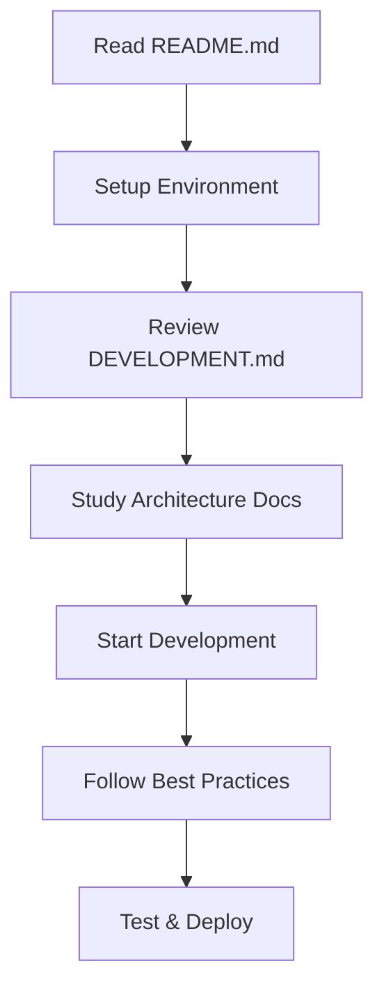

# Documentation Index

Welcome to the StoryBook Creator documentation. This guide will help you understand, develop, and maintain the application.

## 📚 Documentation Overview

### [README.md](../README.md)
**Project overview and quick setup guide**
- Features and tech stack
- Installation instructions
- Environment configuration
- Deployment guidelines

### [API.md](./API.md)
**Complete API reference and integration guide**
- Authentication patterns
- Endpoint specifications
- Request/response schemas
- Error handling and rate limits
- Usage examples

### [COMPONENTS.md](./COMPONENTS.md)
**Component architecture and design patterns**
- Architecture overview
- Component categories and patterns
- State management strategies
- Performance optimizations
- Accessibility standards

### [DATABASE.md](./DATABASE.md)
**Database schema and data management**
- Entity relationships
- Security model and RLS policies
- Query patterns and optimization
- Migration scripts
- Backup and recovery procedures

### [DEVELOPMENT.md](./DEVELOPMENT.md)
**Development workflows and best practices**
- Coding standards and conventions
- Security guidelines
- Testing strategies
- Deployment processes
- Common pitfalls and solutions

## 🚀 Quick Start

1. **New Developer Setup**
   - Read [README.md](../README.md) for initial setup
   - Review [DEVELOPMENT.md](./DEVELOPMENT.md) for coding standards
   - Check [DATABASE.md](./DATABASE.md) for schema understanding

2. **API Integration**
   - Reference [API.md](./API.md) for endpoint details
   - Review authentication patterns
   - Check error handling examples

3. **Component Development**
   - Study [COMPONENTS.md](./COMPONENTS.md) for architecture patterns
   - Follow established component composition patterns
   - Maintain accessibility standards

4. **Database Operations**
   - Review [DATABASE.md](./DATABASE.md) for schema details
   - Follow RLS security patterns
   - Use provided query examples

## 🔧 Development Workflow

## 📋 Documentation Standards

All documentation follows these principles:
- **Clear Examples**: Practical code samples and usage patterns
- **Security Focus**: Security considerations prominently featured
- **Best Practices**: Established patterns and conventions
- **Accessibility**: WCAG compliance and inclusive design
- **Performance**: Optimization strategies and monitoring

## 🤝 Contributing to Documentation

When updating documentation:
1. Keep examples current with codebase
2. Include security considerations
3. Provide practical implementation details
4. Update related documentation sections
5. Test all code examples

## 📞 Getting Help

- **Technical Issues**: Review relevant documentation section
- **Architecture Questions**: Check [COMPONENTS.md](./COMPONENTS.md) and [DATABASE.md](./DATABASE.md)
- **API Integration**: Reference [API.md](./API.md)
- **Development Setup**: Follow [README.md](../README.md) and [DEVELOPMENT.md](./DEVELOPMENT.md)

## 📈 Documentation Roadmap

Future documentation improvements:
- Interactive API documentation
- Component Storybook integration
- Performance monitoring guides
- Advanced deployment strategies
- Testing cookbook

---

**Last Updated**: December 2024  
**Maintained By**: Development Team  
**Version**: 1.0.0